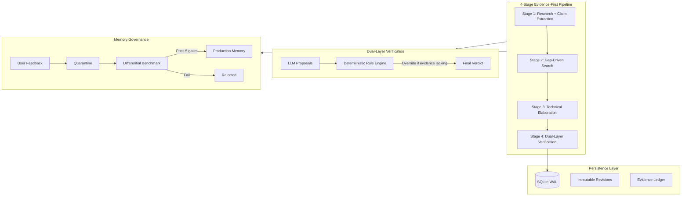

# Self-Evolving Deep Research Agent

A **production-grade, evidence-first deep research system** with dual-layer verification, memory quarantine governance, and differential regression testing. Built on OpenAI Agents SDK + Firecrawl + SQLite WAL.

## Architecture Evolution

> This project originated from the [awesome-llm-apps](https://github.com/Shubhamsaboo/awesome-llm-apps) collection as a basic 3-agent research demo (~200 lines). It has been extensively re-engineered into a **self-evolving research system** with ~6,000 lines of production-grade code, including ~1,500 lines of automated tests.

### Original Contributions (~5,000 lines of original code)

| Component | What I Built | Why It Matters |
|:----------|:-------------|:---------------|
| **Claim-Evidence Data Model** (`schemas.py`, 391 lines) | Pydantic v2 schemas with `Claim`, `EvidenceSource`, `EvidenceCorpus`, temporal validity (`ValidTime`), stance tracking, and `extra="forbid"` | Transforms unstructured LLM output into verifiable structured assertions |
| **Dual-Layer Verification Engine** (`core/agents/verification_agent.py`) | Deterministic Python rule engine that overrides LLM verification proposals — LLM proposes, rules dispose | Eliminates sycophantic self-verification (the #1 failure mode of LLM agents) |
| **Memory Quarantine + Differential Benchmark** (`evaluation/`, `storage.py`) | Quarantine lifecycle for learned rules, dual-branch regression testing with 5 quantitative gates | Prevents model regression from untested feedback |
| **SQLite WAL Storage + Immutable Versioning** (`storage.py`, 840 lines) | Full relational persistence with WAL mode, append-only report revisions with parent pointers, atomic rollback | Production-grade state management replacing fragile JSON files |
| **Production Resilience Framework** (`core/context.py`, `core/resilience.py`) | Circuit breaker (3-state FSM), exponential backoff with jitter, per-stage timeouts, token/cost/call budgets | Prevents cascading API failures and runaway costs |
| **Structured Observability** (`core/observability.py`) | JSON structured logging with `StageTracer` context manager, pipeline summary emission | Production-grade debugging and monitoring support |
| **Comprehensive Test Suite** (`tests/`, 12+ files, ~1,500 lines) | Unit tests covering schemas, state machines, security, citation validation, differential regression, and more | Validates system correctness under adversarial conditions |

### Architecture Diagram



## Key Engineering Features

- **Evidence-First Pipeline**: Research → Gap Detection → Elaboration → Verification. Claims without evidence are never marked as verified.
- **Deterministic Verification Override**: LLM fact-checking proposals are validated by a Python rule engine with veto authority. Fake citations, missing evidence, and temporal inconsistencies are caught deterministically.
- **Memory Quarantine Lifecycle**: `quarantine → benchmark → promote/reject`. No learned rule enters production without passing differential regression tests.
- **Structured Claim-Evidence Schema**: Every assertion has typed `claim_type`, `valid_time`, `scope`, evidence with `stance` and `source_type`, and a deterministic confidence score.
- **Production Resilience**: Circuit breaker, exponential backoff with jitter, per-stage timeouts, and three-dimensional budget guards (tokens, API calls, cost).
- **Immutable Audit Trail**: Append-only report versioning with parent pointers. Rollback creates a new revision, never deletes history.
- **Prompt Injection Defense**: Regex-based injection scanning, URL placeholder blacklisting, credential isolation in `.env`.
- **Multi-Provider LLM Support**: DeepSeek, OpenAI, Qwen, SiliconFlow, or any OpenAI-compatible endpoint.

## Project Structure

```
ai_deep_research_agent/
├── deep_research_openai.py    # Streamlit UI & orchestration
├── schemas.py                 # Pydantic v2 data contracts (Claim, Evidence, Corpus, etc.)
├── storage.py                 # SQLite WAL persistence, versioning, quarantine
├── config_manager.py          # Credential & config management
├── history_manager.py         # Storage facade (backwards compatibility)
├── core/
│   ├── workflow.py            # 4-stage pipeline orchestrator
│   ├── context.py             # RunContext, BudgetConfig, CircuitBreaker
│   ├── resilience.py          # retry_with_backoff, execute_with_timeout
│   ├── observability.py       # Structured JSON logging, StageTracer
│   ├── agents/                # Agent factories (research, elaboration, verification)
│   └── tools/                 # Search tools (Firecrawl), ledger parsers, sanitizers
├── evaluation/
│   ├── runner.py              # Dual-branch differential benchmark runner
│   ├── metrics.py             # Precision, validity, false corroboration, gap recall
│   ├── mock_services.py       # Deterministic offline search & LLM simulator
│   └── cases.jsonl            # Adversarial benchmark cases with ground truths
├── tests/                     # 12+ test files, ~1,500 lines
├── docs/
│   └── SYSTEM_DESIGN.md       # Production scaling architecture design
├── Dockerfile                 # Multi-stage production build
├── docker-compose.yml         # One-command deployment
└── AGENTS.md                  # Production architecture rules (6 mandatory principles)
```

## Requirements

- Python 3.10+
- OpenAI or DeepSeek API key
- Firecrawl API key

## Installation

```bash
# Install dependencies
pip install -r requirements.txt

# Or with uv
uv pip install -r requirements.txt
```

## Usage

### Run Locally

```bash
streamlit run deep_research_openai.py
# Or with uv:
uv run streamlit run deep_research_openai.py
```

### Run with Docker

```bash
# Copy and fill in your API keys
cp .env.example .env

# Build and run
docker-compose up -d

# Access at http://localhost:8501
```

### Run Tests

```bash
# Run all tests
pytest tests/ -v

# Run with coverage
pytest tests/ -v --cov=. --cov-report=term-missing

# Run offline benchmark
python -m evaluation.runner
```

## Configuration

1. Select your LLM provider in the sidebar (DeepSeek, OpenAI, Qwen, SiliconFlow, or Custom)
2. Enter your LLM API key
3. Enter your Firecrawl API key
4. Enter your research topic and click **"Start Research"** (🚀 开始深度研究)
5. Review the multi-tab report: Final Verified Report, Evidence Ledger, Fact-Checking Audit, Elaboration Draft, Initial Draft, Revision History
6. Use the **Feedback Loop** to request revisions
7. Use the **Memory Governance** panel to manage quarantined rules and production memories
