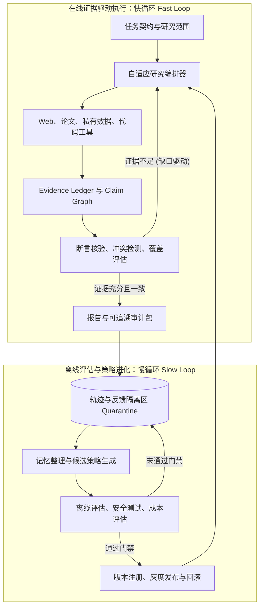

# 可治理的持续改进与自进化 Deep Research Agent 架构设计 (v2.0)

> **核心定位**：建立一个**评价驱动、证据先行、隔离准入、具备版本晋级与安全回滚能力**的企业生产级自进化深度研究系统。

---

## 目录
- [一、背景与架构范式重构](#一背景与架构范式重构)
- [二、进化成熟度等级模型 (L1–L4)](#二进化成熟度等级模型-l1l4)
- [三、顶层架构：快慢双循环闭环体系](#三顶层架构快慢双循环闭环体系)
- [四、六大核心治理与进化支柱](#四六大核心治理与进化支柱)
  - [1. 证据驱动时序：证据先行与缺口再搜索](#1-证据驱动时序证据先行与缺口再搜索)
  - [2. Claim–Evidence 时空可追溯证据模型](#2-claimevidence-时空可追溯证据模型)
  - [3. 多维信源上下文信誉模型](#3-多维信源上下文信誉模型)
  - [4. 记忆准入隔离区与安全防投毒防御](#4-记忆准入隔离区与安全防投毒防御)
  - [5. 科学评价函数与三维评估指标体系](#5-科学评价函数与三维评估指标体系)
  - [6. 探索配额与双向经验学习](#6-探索配额与双向经验学习)
- [五、核心数据模式规范 (Data Schemas)](#五核心数据模式规范-data-schemas)
- [六、生产级技术栈选型与演进路线](#六生产级技术栈选型与演进路线)

---

## 一、背景与架构范式重构

在原型验证（MVP）阶段，多数 Agent 系统将“长期记忆”简单等同于“自进化”。然而在企业级生产环境下，缺乏治理闭环的记忆沉淀存在三大致命隐患：
1. **无评价函数即无真实进化**：无法量化验证系统调整后的净收益，单点修复常导致大范围“负迁移（Negative Transfer）”；
2. **反思直写长期记忆导致永久污染**：大模型反思本身的幻觉、以及网页提示注入（Prompt Injection）会转化为永久性毒化记忆；
3. **扁平事实缺乏时态与口径**：现实世界事实具备复杂的生命周期（如 Preview/Beta/GA 发布阶段、年报统计口径与时间差），简单三元组无法支撑严肃审计。

**本设计 v2.0 将架构核心从“记忆堆叠”升维为“闭环治理”，确立“无评价不进化、证据先行于成稿、候选经验必隔离”的工程底线。**

---

## 二、进化成熟度等级模型 (L1–L4)

系统将自主进化能力严格划分为四个演进阶梯：

```text
L1: 记忆事实与偏好 (Fact & Persona Storage) ────> 当前基线
      ↓
L2: 结构化经验、检索策略与技能学习 (Reflective Experience & Skill Acquisition)
      ↓
L3: 基于评价集闭环优化 Prompt 与工作流 (Automated Prompt & Workflow Optimization, 如 DSPy)
      ↓
L4: 策略级强化学习与模型参数自进化 (Policy-level RL with Rollback, 如 Agent Lightning)
```
- **当前系统定位**：完成 L1 向 L2 演进；
- **系统目标形态**：稳定运行于 L3，预留 L4 轨迹与奖励接口。

---

## 三、顶层架构：快慢双循环闭环体系

生产级架构将研究流程解耦为高敏捷的**在线快循环**与强治理的**离线慢循环**：



### 1. 快循环核心机制 (Online Fast Loop)
- **拒绝倒置时序**：颠覆“先写万字长文，再由核查 Agent 挑刺”的传统模式（该模式易被前文错误叙事锚定，甚至导致核查 Agent 丢弃正文）。
- **证据先行（Evidence-First）**：自适应编排器调度工具抓取数据后，首先构建结构化 `Evidence Ledger` 与 `Claim Graph`；
- **缺口驱动再搜索（Gap-Driven Re-search）**：在生成正文前执行断言核验与覆盖评估，若关键维度证据存疑或缺失，自动触发二次定向搜索；证据齐备后才交由主笔成稿。

### 2. 慢循环核心机制 (Offline Slow Loop)
- **隔离区机制（Quarantine Gating）**：任何反思结果、用户修改意见、新提炼的避坑规则一律进入隔离区，不得直接修改生产 Prompt 或长期记忆；
- **发布门禁（Promotion Gate）**：候选经验与 Prompt 在离线基准集（Regression Suite）完成自动化回归，当且仅当**质量指标上升、负迁移率低于阈值、安全红线测试通过**时，才打上版本号注册并灰度生效。

---

## 四、六大核心治理与进化支柱

### 1. 证据驱动时序：证据先行与缺口再搜索
- 研究流程必须严格遵循：`任务契约定义` $\rightarrow$ `分片并行检索` $\rightarrow$ `证据归集 (Evidence Ledger)` $\rightarrow$ `断言核验与交叉消歧` $\rightarrow$ `缺口驱动再检索` $\rightarrow$ `最终研报成稿`。

### 2. Claim–Evidence 时空可追溯证据模型
摒弃扁平无时态的 `[实体 -> 属性 -> 值]`，全面采用兼容 W3C PROV-O 与 GraphRAG 标准的证据链模型：
- 显式声明断言的**时态边界（`valid_time`）**、**适用范围（`scope`）**与**证据支撑立场（`stance`）**；
- 引入**独立性聚类（`independence_cluster`）**，防范多个新闻聚合站对同一虚假源的“假性相互佐证”。

### 3. 多维信源上下文信誉模型
域名信誉不得采用单一静态总分，而是构建四元上下文信誉张量：
$$\text{Trust} = f(\text{信源主体}, \text{断言类型}, \text{时间窗口}, \text{文档类型})$$
- 典型案例：官方技术博客对“产品功能与发布阶段”权威度极高，但对“行业领先地位声明”权威度权重降低；arXiv 属于预印本托管，其技术方法论未经验证，权威度不能等同于经 Peer-Review 的顶级期刊。

### 4. 记忆准入隔离区与安全防投毒防御
- **防御模型**：构建对抗性网页提示注入（Prompt Injection）与向量库污染的专用边界；
- **两权分立**：负责与外部非受信网页交互的 Agent 无权执行持久化写操作；负责提炼经验的 Reflection 模块必须经过确定性校验，其输出仅进入隔离区候选池。

### 5. 科学评价函数与三维评估指标体系
建立自动化进化所需的联合目标函数：

| 评估维度 | 核心量化指标 | 观测目标 |
| :--- | :--- | :--- |
| **报告质量 (Quality)** | 断言事实准确率 (Claim Precision)、引用支持率 (Citation Recall)、一手信源占比、逻辑一致性评分 | 确保输出研究成果的高保真度与学术可信性 |
| **进化质量 (Evolution)** | 重复错误复发率、负迁移率 (Negative Transfer Rate)、候选经验晋级率、过期事实遗忘率 | 证明系统确实“越用越强”，而非局部过拟合 |
| **工程效能 (Engineering)** | 单报告 Token 消耗、平均检索耗时、缓存命中率、提示注入防御拦截率 | 确保进化过程具备商业可行性与成本可控性 |

### 6. 探索配额与双向经验学习
- **探索配额 (Exploration Allowance)**：系统保留 15%~20% 的检索配额分配给长尾新兴信源，结合 Contextual Bandit 机制，避免算法单纯强化历史成功模板导致信息茧房；
- **正负双向轨迹沉淀**：不仅记录失败卡片（Mistake Bank），同步沉淀高质量的成功规划轨迹与有效查询词组合（Golden Trajectories）。

---

## 五、核心数据模式规范 (Data Schemas)

### 1. 结构化断言与证据规范 (`Claim-Evidence Schema`)
```json
{
  "claim_id": "claim_wm_2026_014",
  "statement": "World Labs 于 2025 年 11 月 12 日正式全面开放其空间世界模型 Marble",
  "claim_type": "product_general_availability",
  "scope": {
    "product": "World Labs Marble",
    "release_stage": "General Availability (GA)",
    "target_domain": "3D World Generation"
  },
  "valid_time": {
    "effective_from": "2025-11-12",
    "effective_to": null
  },
  "status": "corroborated",
  "evidence": [
    {
      "evidence_id": "ev_001",
      "url": "https://www.worldlabs.ai/blog/marble-world-model",
      "source_type": "first_party_announcement",
      "published_at": "2025-11-12",
      "retrieved_at": "2026-09-06",
      "quote_locator": "Paragraph 1: 'Today we are making Marble publicly available...'",
      "content_hash": "sha256_8f12a...",
      "stance": "supports",
      "independence_cluster": "cluster_worldlabs_direct"
    }
  ],
  "confidence": {
    "score": 0.98,
    "verifier_version": "v2.0_multi_agent"
  },
  "provenance": {
    "task_id": "run_20260905_195304",
    "extractor_model": "deepseek-chat",
    "pipeline_stage": "FastLoop_Verification"
  }
}
```

### 2. 隔离区候选策略记录 (`Quarantine Candidate Schema`)
```json
{
  "candidate_id": "cand_rule_20260906_002",
  "source_task_id": "run_20260905_195304",
  "rule_type": "mistake_avoidance",
  "domain": "World Model Timeline",
  "pattern": "避免将 2025 年末发布的 Marble 标注为 2026 年新品",
  "proposed_action": "在检索阶段前置校验官方发布公告日",
  "status": "quarantined",
  "quarantine_checks": {
    "prompt_injection_scan": "passed",
    "regression_eval_passed": null,
    "negative_transfer_score": null
  },
  "created_at": "2026-09-06 01:45:00"
}
```

---

## 六、生产级技术栈选型与演进路线

### 1. 生产级持久化底座选型
- **运行时核心数据库**：全面替代裸 JSON 存储，采用支持并发、事务与零配置维护的 **SQLite WAL 模式**（单机生产推荐）或 **PostgreSQL**；
- **图存储计算**：单机采用嵌入式图数据库 **Kùzu** 或轻量关系模式模拟，杜绝将纯内存图分析库（如 NetworkX）作为持久化数据库；
- **格式约束**：所有章节输出与断言提取严格绑定 **Pydantic v2 / JSON Schema** 强契约，禁止依赖 Temperature 进行结构控制。

### 2. 三阶段落地节奏

```text
阶段一：可靠性与工程底座夯实 (当前建议)
├─ 将运行时状态迁移至 SQLite WAL，建立 Evidence Ledger 数据表
├─ 升级流水线为“证据先行、缺口驱动再搜索”
├─ 建立本地隔离区 (Quarantine) 机制与基础回归评测集
└─ 移除不可靠统计与绝对化措辞

阶段二：多维信誉与经验检索 (L2 达成)
├─ 落地 Claim–Evidence 图谱与四元信源信誉模型
├─ 引入本地嵌入进行避坑规则语义精准召回
└─ 引入 15% 探索配额与双向轨迹沉淀

阶段三：自动策略优化与评估闭环 (L3 达成)
├─ 对接 DSPy (GEPA / MIPROv2) 框架，基于评测集自动优化检索与写作 Prompt
├─ 建立全自动离线发布门禁与灰度回滚管道
└─ 探索参数与策略级强化学习 (L4)
```

---

> 📌 **架构哲学**：真正的自进化绝不是把一切对话无序塞进向量库，而是在严格的工程隔离与科学的评价函数护航下，让系统具备**去伪存真、可验证、可审计、可回滚的认知生长能力**。
